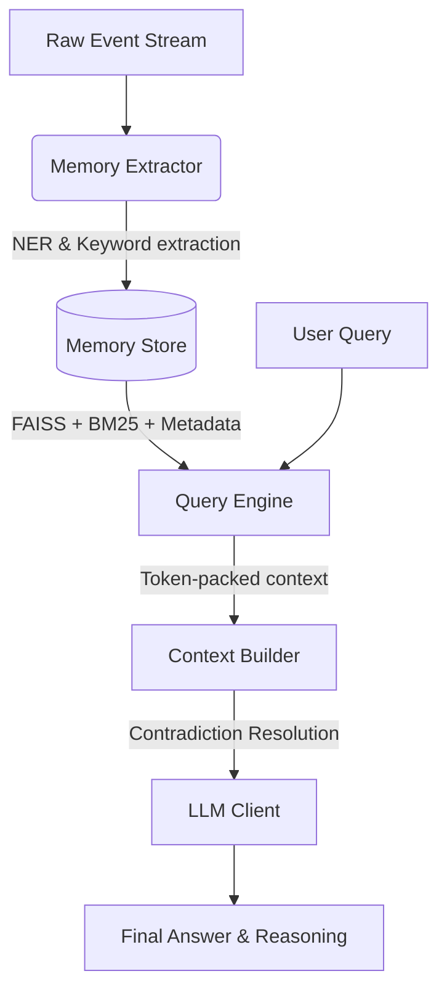

# Memorae

A personal memory query engine that ingests raw event streams (messages, calendar events, notes) and answers natural-language queries. Built for offline and LLM-assisted evaluation using a modular architecture.

## 1. Project Overview

Memorae acts as an intelligent context engine over mock personal data. It uses hybrid retrieval (BM25 + Semantic) combined with metadata scoring (recency, urgency, source trust) to build highly relevant contexts for LLMs. It features deterministic contradiction resolution and supports multi-provider model fallback chains.

## 2. Architecture Diagram



## 3. Retrieval Pipeline

The retrieval pipeline evaluates every memory across seven weighted dimensions (defined in `core/config.py`):
- **Semantic (30%)**: FAISS L2 distance via `all-MiniLM-L6-v2`.
- **BM25 (20%)**: Term frequency/IDF matching.
- **Importance (20%)**: Keyword-based imperative signals.
- **Urgency (15%)**: Real-time risk and deadline detection.
- **Recency (10%)**: Exponential decay over 72 hours.
- **Relationship (5%)**: Entity matching against the query.
- **Source Trust (5%)**: Static weights based on the system of record (e.g., Calendar > WhatsApp).

## 4. Memory Pipeline

The memory pipeline transforms raw text events into structured `Memory` objects (`core/memory_extractor.py`):
1. **Noise Filtering**: High-frequency low-signal events (e.g., OTPs, casual chatter) are dropped before processing.
2. **Entity Extraction**: spaCy NER acts as a zero-shot fallback alongside dataset-seeded keyword matching to identify projects and people.
3. **State Transitions**: Generic regex patterns detect entity resolutions and blockers (e.g., "X is now approved") regardless of the specific entity.

## 5. Features

- **Hybrid Search**: Combines exact keyword matching with semantic similarity.
- **Contradiction Resolution**: Detects changing dates and values for topics over time, injecting explicit corrections into the LLM context.
- **Multi-Model Fallback**: Automatically cascades through OpenAI and Gemini model tiers based on rate limits or API availability.
- **Token Budgeting**: Greedily packs the LLM context window to avoid exceeding defined limits.

## 6. How to Run

1. Clone the repository and install dependencies:
   ```bash
   pip install -r requirements.txt
   ```
2. Configure `.env` (optional, defaults to included Gemini free tier):
   ```
   LLM_PROVIDER=gemini
   GEMINI_API_KEY=your_key
   ```
3. Run the CLI:
   ```bash
   # Run the preset queries
   python main.py
   
   # Run a custom query
   python main.py --query "What is the status of the UIE proposal?"
   ```
4. Or run the HTTP API (via Uvicorn or Docker):
   ```bash
   # Local HTTP Server
   uvicorn api.api:app --host 0.0.0.0 --port 8000
   
   # Docker
   docker-compose up
   ```
   The API will be available at `http://localhost:8000/docs`.

## 7. Evaluation

The system is tested across four dimensions (`evaluation.py`):
1. **Offline**: Deterministic tests for retrieval ranking, noise filtering, and recency bias.
2. **Regression**: Validates LLM outputs against required facts for preset queries.
3. **Generalization**: Ensures unseen queries return structurally valid and contextually aware answers.
4. **Online**: Measures latency and context efficiency (token usage ratios).

Run evaluations:
```bash
python evaluation.py
```

## 8. Repository Structure

```
memorae_mock_events.json  # Raw data source
evaluation.py             # Evaluation framework
main.py                   # CLI entry point
core/
  config.py               # Constants and environment configuration
  context_builder.py      # Token packing and contradiction resolution
  event_store.py          # Base data structures
  memory_extractor.py     # NLP entity and state extraction
  memory_store.py         # FAISS/BM25 indexing and retrieval
  project_builder.py      # Aggregates memories into high-level project states
  query_engine.py         # Orchestrates extraction, retrieval, and generation
llm/
  llm_client.py           # Provider router
  gemini_client.py        # Gemini API implementation
  openai_client.py        # OpenAI API implementation
api/
  api.py                  # HTTP Server (FastAPI)
```

## 9. Design Choices

- **Dataset-Agnostic Core**: Hardcoded logic was removed. `MemoryExtractor` accepts overrides, and contradiction detection works on arbitrary topics based on leading content words.
- **Minimal Dependencies**: We stripped out heavy visualization tools and front-end dependencies to keep the engine maximally lean, focusing entirely on the core retrieval and generation loop.
- **Graceful Fallbacks**: The system falls back to regex/keyword matching if heavier ML libraries (like spaCy or FAISS) are unavailable in the environment.

## 10. Known Limitations

- **Context Window Ceiling**: Extremely large datasets with high token concentration around a single query may push low-ranked but relevant facts out of the budget.
- **Simple Clustering**: Contradiction resolution uses a naive 2-word topic fingerprint which may over-cluster distinct but similarly phrased events.
